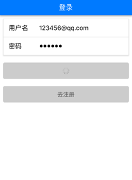
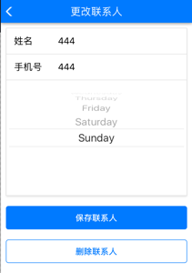
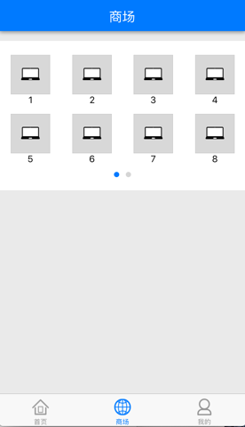
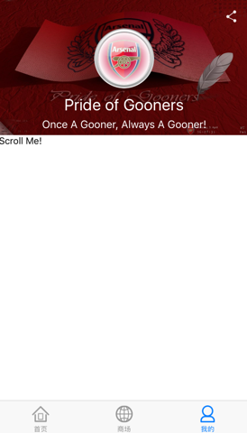

## 测试账号
邮箱：123456@qq.com

密码：123456

## APP页面

## 知识点
* 1、react native
* 2、redux
  * 截止目前, redux是为了使用而使用
* 3、firebase
  * Authentication
    * `createUserWithEmailAndPassword` 邮箱注册
    * `signInWithEmailAndPassword` 登录
  * database
    * `set` 添加
    * `remove` 删除
    * `on` 监听数据变化
